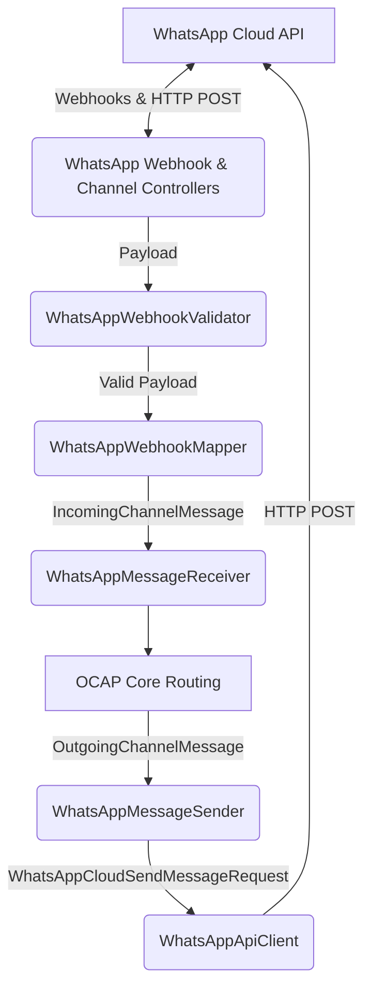

# CAP-06: WhatsApp Enterprise Channel Runtime

## Overview
The WhatsApp Enterprise Channel Runtime provides native integration with the WhatsApp Cloud API (Facebook Graph API) for the Open Conversational Automation Platform (OCAP). It acts as a bridge between WhatsApp users and the OCAP agents/workflows, seamlessly implementing the `IChannelProvider`, `IMessageSender`, and `IMessageReceiver` contracts defined in `OCAP.Channels.Abstractions`.

## Architecture

This module follows the Clean Architecture principles established in OCAP:
- **No business logic in Controllers**: The controllers (`WhatsAppWebhookController` and `WhatsAppChannelController`) are strictly for ingestion (webhooks) and management (lifecycle/health).
- **Agnostic Mappers**: The `WhatsAppWebhookMapper` transforms WhatsApp's complex JSON payloads into OCAP's agnostic `IncomingChannelMessage`.
- **Abstracted Providers**: The `WhatsAppChannelProvider` implements `IChannelProvider` to register and manage the lifecycle of the WhatsApp channel within OCAP.
- **Message Dispatching**: The `WhatsAppMessageSender` translates OCAP's `OutgoingChannelMessage` into WhatsApp Cloud API requests and dispatches them via the `WhatsAppApiClient`.

### Component Diagram



## Security

Security is critical when receiving webhooks from Facebook. The module implements:
- **HMAC SHA-256 Validation**: The `WhatsAppWebhookValidator` automatically validates the `X-Hub-Signature-256` header against the configured App Secret. This ensures that the request genuinely originated from Meta/Facebook.
- **Verify Token Validation**: Required during the initial webhook subscription setup. The `hub.verify_token` is validated to authorize the webhook endpoint.
- **Audit Trails**: Security events (such as missing/invalid signatures) are logged via `ISecurityAuditService`.

## Configuration

Add the following configuration to your `appsettings.json`:

```json
"WhatsApp": {
  "BaseUrl": "https://graph.facebook.com/v17.0/",
  "PhoneNumberId": "YOUR_PHONE_NUMBER_ID",
  "AccessToken": "YOUR_SYSTEM_USER_ACCESS_TOKEN",
  "AppSecret": "YOUR_APP_SECRET",
  "WebhookVerifyToken": "YOUR_WEBHOOK_VERIFY_TOKEN",
  "MaxRetryAttempts": 3
}
```

## Lifecycle Management

The `WhatsAppRuntimeManager` manages the active state of the channel. When the system initializes, the `WhatsAppChannelProvider` calls the manager to ensure connection health and register the provider inside OCAP's channel ecosystem.

## Dependencies

- **OCAP.Channels.Abstractions**: Core contracts (`IChannelProvider`, `IMessageSender`, etc.)
- **OCAP.Security.Abstractions**: Security auditing (`ISecurityAuditService`)
- **System.Text.Json**: For efficient, native serialization/deserialization.
- **HttpClient**: Managed via ASP.NET Core's `IHttpClientFactory` for resilience.

## Build and Tests

Unit tests are located in `OCAP.Channels.WhatsApp.Tests`. To execute them:
```bash
dotnet test tests/OCAP.Channels.WhatsApp.Tests
```
The tests cover HMAC validation, payload validation, and correct mapping to OCAP abstractions.
