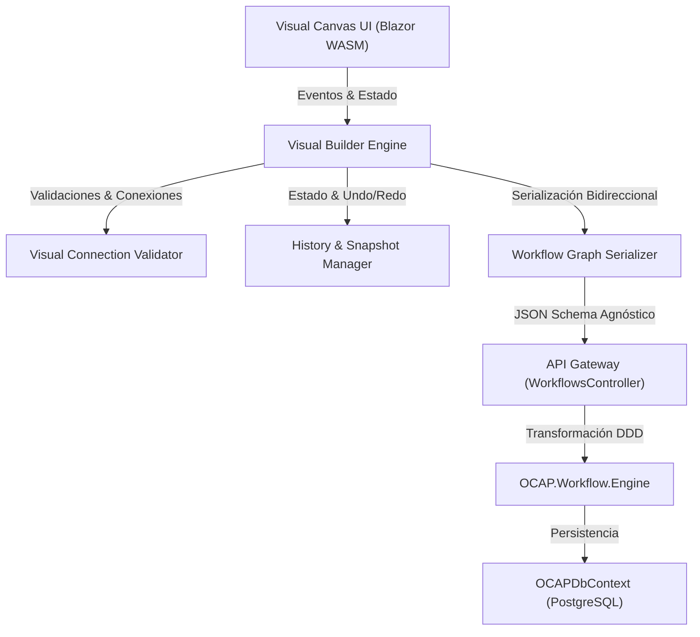

# OCAP — Visual Workflow Builder & Business Automation Studio

## Visión General
El **OCAP Visual Workflow Builder** es un entorno de diseño visual interactivo de nivel empresarial, conceptualmente comparable a plataformas como **n8n**, **Microsoft Power Automate**, **Langflow** y **Node-RED**.

Permite a desarrolladores y usuarios de negocio construir, simular, validar y publicar procesos automatizados desacoplados mediante un canvas visual bidireccional.

---

## Arquitectura y Componentes del Builder



### Componentes Clave:
1. **Visual Canvas Container (`WorkflowCanvas.razor`)**: Lienzo interactivo con zoom, pan, cuadrícula snap-to-grid, minimapa, selección múltiple y comandos virtuales (undo/redo).
2. **Visual Node System (`VisualNodeComponent.razor`)**: Componentes de renderizado dinámico con categorización por colores, conectores/puertos múltiples, íconos SVG y badges de validación.
3. **Properties Sidebar (`NodePropertiesPanel.razor`)**: Inspector lateral reactivo para configurar parámetros de nodos, expresiones lógicas, variables de contexto, prompts de IA y herramientas empresariales.
4. **Validation & Connection Engine (`WorkflowConnectionValidator.cs`)**: Motor de reglas para prevenir ciclos acíclicos directos (DAG), conexiones incompatibles, nodos huérfanos y variables no declaradas.
5. **Simulation & Step Debugger (`WorkflowSimulator.razor`)**: Ejecutor interactivo paso a paso para depurar y visualizar el estado del contexto en tiempo real.
6. **Template & Catalog Manager (`WorkflowTemplates.razor`)**: Galería de plantillas empresariales pre-construidas e importación/exportación JSON.

---

## Mapeo de Nodos Visuales y Motor de Dominio

| Categoria | Tipo de Nodo | Ícono / Color | Puertos | Propósito Principal |
| :--- | :--- | :--- | :--- | :--- |
| **Inicio & Fin** | `Start` | 🟢 Verde (#10B981) | Out | Punto de entrada del workflow |
| **Inicio & Fin** | `End` | 🔴 Rojo (#EF4444) | In | Conclusión del proceso |
| **Lógica** | `Condition` | 🟡 Amarillo (#F59E0B) | In, Out (True/False) | Bifurcación condicional booleana |
| **Lógica** | `Switch` | 🟡 Amarillo (#F59E0B) | In, Out (Multi-Branch) | Bifurcación por múltiples rutas |
| **Lógica** | `Loop` | 🟣 Morado (#8B5CF6) | In, Loop, Out | Iteración sobre colecciones |
| **Concurrencia** | `Parallel` | 🔵 Azul (#3B82F6) | In, Out (Ramas) | Ejecución paralela multihilo |
| **Concurrencia** | `Merge` | 🔵 Azul (#3B82F6) | In (Ramas), Out | Convergencia de tareas concurrentes |
| **Inteligencia** | `LLM` | 🦄 Violeta (#A855F7) | In, Out | Invocación de proveedores IA Generativa |
| **Acciones** | `Tool` | 🟧 Naranja (#F97316) | In, Out | Ejecución de herramientas registradas |
| **Espera** | `Delay` | 🩶 Gris (#6B7280) | In, Out | Pausa por tiempo definido |
| **Espera** | `Wait` | 🩶 Gris (#6B7280) | In, Out | Espera de evento o señal externa |
| **Intervención** | `HumanApproval` | 💖 Rosado (#EC4899) | In, Out (Aprobado/Rechazado) | Pausa para aprobación humana |
| **Conectividad** | `Webhook` | 🟤 Café (#78350F) | Out | Disparo por evento HTTP entrante |
| **Conectividad** | `ApiRequest` | 🟤 Café (#78350F) | In, Out | Llamada HTTP REST saliente |
| **Código** | `Script` | 🔷 Cyan (#06B6D4) | In, Out | Ejecución de script liviano |
| **Sub-Proceso** | `SubWorkflow` | 🟩 Esmeralda (#059669) | In, Out | Invocación de workflow anidado |
| **Resiliencia** | `ErrorHandler` | 🟥 Granate (#991B1B) | In, Out | Captura y manejo de excepciones |

---

## Serialización Bidireccional Reversible (Visual Graph ↔ WorkflowDefinition)

El esquema JSON producido por el editor visual mapea de forma isomórfica hacia la entidad de dominio `WorkflowDefinition`:

```json
{
  "id": "wf-b87e21a0",
  "name": "Proceso Inteligente de Atención",
  "description": "Flujo visual con IA y herramientas",
  "version": 1,
  "nodes": [
    {
      "id": "node-1",
      "stepId": "start_1",
      "name": "Inicio de Evento",
      "type": "Start",
      "position": { "x": 100, "y": 200 },
      "configurationJson": "{\"trigger\":\"webhook\"}"
    },
    {
      "id": "node-2",
      "stepId": "llm_1",
      "name": "Resumen IA",
      "type": "LLM",
      "position": { "x": 350, "y": 200 },
      "configurationJson": "{\"prompt\":\"Analizar solicitud\"}"
    }
  ],
  "edges": [
    {
      "id": "edge-1",
      "fromNodeId": "node-1",
      "toNodeId": "node-2",
      "fromPort": "output",
      "toPort": "input",
      "conditionExpression": ""
    }
  ]
}
```

---

## Comunicación API REST
- `GET /api/workflows/templates`: Catálogo de plantillas empresariales pre-construidas.
- `POST /api/workflows/simulate`: Ejecución simulada interactiva paso a paso.
- `POST /api/workflows/export`: Exportación del flujo visual a JSON/YAML.
- `POST /api/workflows/import`: Importación y reconstrucción visual desde JSON.
